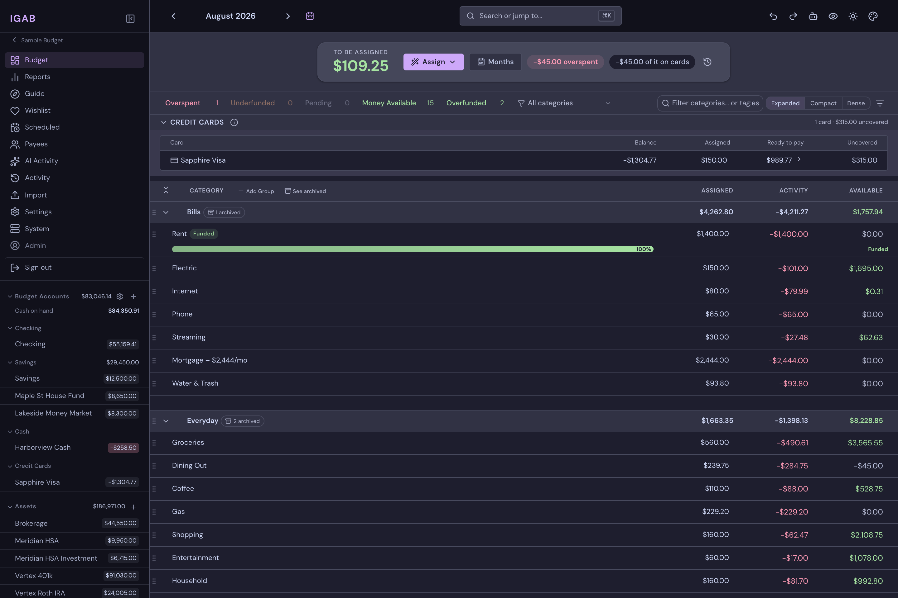
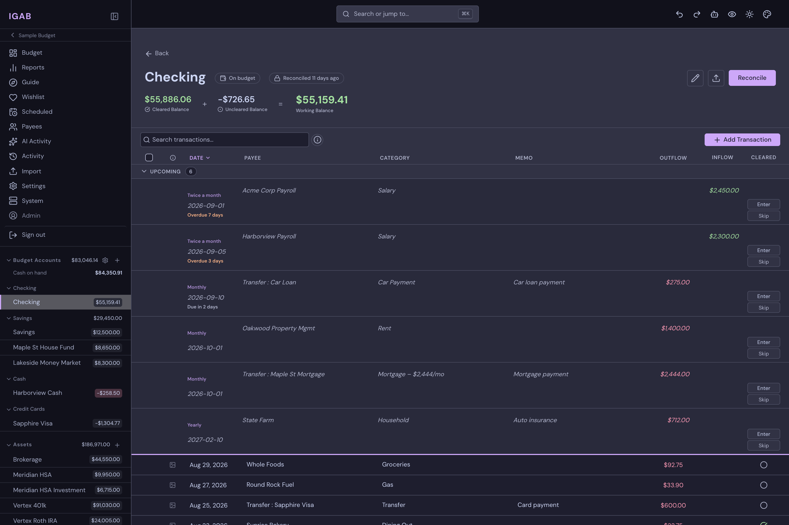

<p align="center">
  
</p>

<h1 align="center">IGAB — I've Got A Budget</h1>

<p align="center">
  <strong>Self-hosted envelope budgeting for your household.<br/>Your money, your data, your hardware.</strong>
</p>

<p align="center">
  <a href="#features">Features</a> •
  <a href="#screenshots">Screenshots</a> •
  <a href="#getting-started">Getting Started</a> •
  <a href="#operations">Operations</a> •
  <a href="CONTRIBUTING.md">Contributing</a>
</p>

<p align="center">
  
  
  
  
  
</p>

---

## Why IGAB?

IGAB is a **zero-based envelope budgeting app** you run yourself. Give every
dollar a job, sync transactions straight from your bank, reconcile against
statements, and understand where your money actually goes — without a
subscription, and without your financial history living on someone else's
servers.

It also tries to answer the question a ledger can't: **what should I do
next?** A guided roadmap reads your real numbers, shows where you stand, and
explains itself — with a checkup, calculators, and a wishlist that all work
from the same numbers.

Built for a small household (1–2 people) that budgets daily or weekly and
wants a tool that is **steady, clear, and trustworthy** — not a fintech
product trying to impress you.

### Privacy First

Your financial data is deeply personal. IGAB keeps it that way:

- **Runs entirely on your hardware** — your server, your database, your backups
- **No analytics, no tracking, no telemetry** — zero data leaves your network
- **No subscription fees** — no incentive to monetize your spending patterns
- **Bank sync through SimpleFIN** — you control the connection, encrypted tokens stored locally
- **Optional AI features use local Ollama** — even the AI runs on your machine

### Reports That Actually Help

Twenty-one reports across six groups give you the visibility you need to plan and understand your finances:

| Group | Reports |
| --- | --- |
| Overview | Spending, income, net change, and ready-to-assign on one dashboard |
| Financial State | Net worth, account composition, liabilities, savings tracker |
| Cash Flow | Income vs. expenses, burn rate, Sankey money-flow diagram, cash projection |
| Budget | Budget vs. actual, cumulative variance, volatility |
| Spending | Pareto breakdown, treemap, seasonality heatmap, subscriptions |
| Insights | Plan vs. reality, anomaly detection, payee analysis, day-of-week patterns (with payday effect), event timeline |

Filter by date range, category, payee, or account; monthly reports have their own time horizons.

---

## Screenshots

<p align="center">
  
</p>

<p align="center"><em>The budget grid — every dollar assigned a job.</em></p>

<p align="center">
  
</p>

<p align="center"><em>The account register — cleared, uncleared, and working balances, with upcoming scheduled transactions.</em></p>

<p align="center">
  <a href="screenshots/"><strong>See more screenshots →</strong></a>
</p>

---

## Features

### Budgeting
- Monthly budget grid with category groups, targets, and available balances
- Move money between categories in place — cover overspending in two clicks
- Auto-assign and quick-budget helpers for funding categories
- Custom saved budget views (filter and arrange the grid the way you think)

### Guidance & Tools
- **A roadmap that reads your budget** — the r/personalfinance flowchart,
  re-authored as data: walk it one step at a time, read it end to end, or
  explore the map. It marks where you actually are
- **Every inference is explained, correctable, and optional** — IGAB shows
  how it decided; point it at the right category or account, tell it about
  money it can't see, or switch personalization off entirely
- **A checkup with no score** — each figure against the target the roadmap
  states, plus a health report you run when you want it. The only ambient
  signal is a small amber dot on the step concerned
- **Calculators you can check by hand** — avalanche vs. snowball, pay down
  vs. save, compare two loans, size an emergency fund
- **A wishlist inside the budget** — a want gets an envelope, a cooling-off
  period, and a place in line; the numbers say when, and IGAB shows what
  pulled money out of it
- **A plain-language glossary** — what each term means, and where it lives in
  the app
- **It never pushes** — no notifications, digests, or badges. Educational
  only: no advice, no market projections, no single health score

### Accounts & Transactions
- On-budget and tracking accounts — checking, savings, cash, credit cards, loans, investments — plus custom account types
- Full transaction editor: splits, transfers, memos, flags, file attachments
- Bulk actions — categorize, approve, or clean up many transactions at once
- Payee management with merge tooling and fuzzy duplicate detection
- Scheduled/recurring transactions
- Statement reconciliation with adjustment handling
- **Loans and liabilities** — amortization schedules, promotional-financing
  periods, and a payoff estimate based on what you actually pay, not the
  minimum

### Bank Sync & Import
- **SimpleFIN sync** — link multiple banks, with encrypted tokens, scored
  deduplication, and a review queue for uncertain matches
- **Four clearing states, one meaning each** — pending, uncleared, cleared,
  reconciled. A hold that posts clears in place; a changed amount goes to
  review instead of being applied silently
- **YNAB import** — bring over your full export (accounts, categories,
  transactions, budget history) and start where YNAB left off: every envelope
  and card reserve opens at YNAB's own figures at the export's last complete
  month, so day one matches the screen you just left. Earlier history still
  imports in full for the register and reports; envelope math simply starts
  at the handoff instead of re-deriving years of history under different
  rules. Every import checks Ready to Assign against the export's own figures
  and says where the two differ — keep YNAB around until you trust the
  numbers (see docs/ynab-import.md)
- **CSV import** — per-account bank CSV import with configurable parsing
  (including EU decimal formats) and hash-based dedup

### AI Assist *(optional)*

Everything here runs against your own [Ollama](https://ollama.com/) server —
nothing leaves your network — and switches off cleanly when AI is disabled or
unreachable.

- **Receipt → transaction** — photograph a receipt (or pick an image or PDF)
  and a local vision model drafts the transaction, files the image as its
  attachment, and turns itemized lines into splits
- **Yours to approve** — scans land unapproved in a review queue, and run in
  the background so you can keep moving
- **A bad scan never costs you the photo** — if extraction fails you still get
  a transaction with the receipt attached
- **Type it or say it** — "coffee at Starbucks 5.50 yesterday" becomes a drafted
  transaction, by keyboard or by microphone
- **Payee normalization and category suggestions** on ordinary manual entry
- **AI Activity page** — every job with its model, prompt, and raw response, so
  you can see why it guessed what it did

Configured in Settings → AI. Receipt scanning needs a **vision-capable** model;
the text features work with any general model.

### Mobile & PWA
- **Installable app** — add IGAB to your home screen; the shell is precached
  for instant launches, data is always live, and new versions arrive via an
  in-app prompt
- **Phone-first UI** — bottom tab navigation, bottom sheets, card layouts,
  long-press multi-select
- **Quick-add** — amount-first entry built for the checkout line: payee memory
  prefills the category, "save & add another" chains purchases, and a receipt
  splits without leaving the sheet
- **Receipt camera** — snap a photo while adding a transaction (HEIC included);
  hand it to the scanner and the transaction fills itself in
- **Nearby payees** *(opt-in, per device)* — quick-add suggests payees you've
  used near where you're standing; coordinates stay on your server

### Comfort & Polish
- **20 themes, each in light and dark** — 40 variants in all: Default, Gruvbox,
  Catppuccin, Rosé Pine (+ Moon), Nord (+ Aurora), Synthwave, Cozy, Vapor,
  Kodachrome, Phosphor, Blueprint, Desert, Bauhaus, Paper, E-Ink, 90's, 80's,
  and 80's Pop
- **Contrast is tested, not assumed** — an automated suite holds every palette to
  WCAG AA across all its surfaces, and the UI honors `prefers-contrast`
- **⌘K command palette** — navigation, budget actions, theme switching, and live
  search from one prompt
- Information-dense, keyboard-friendly, and calm — color is reserved for state
  that matters

### Household & History
- **Share a budget** — invite another person as owner or member; owners manage
  membership, members do everything day-to-day
- **Undo** — edits are reversible one at a time or as a batch; a bad CSV import
  is one undo, not an evening of cleanup

### Operations Built In
- Automated **daily database backups** with retention pruning (production
  profile), plus one-command manual backup and restore
- **Data integrity checker** in Settings (and via API) that audits your
  budget's invariants and points at the offending transactions
- Single-command Docker Compose deployment with an nginx production profile

---

## Getting Started

### Requirements

- Docker with Compose
- [`just`](https://github.com/casey/just) — command runner

### Quick Start

```sh
git clone <this-repo> igab && cd igab
just init          # copies .env.example → .env
$EDITOR .env       # set DB credentials, SECRET_KEY, admin login, ports
just dev           # start the full stack (db, api, frontend) with live reload
just migrate       # run database migrations
```

Open the frontend (the port you set in `.env`) and log in with the
`ADMIN_EMAIL` / `ADMIN_PASSWORD` you configured — the admin user is created
automatically on first run.

### Explore with a Sample Budget

Generate a realistic sample budget before entering your own data (also
available from the budget selector's "Try a Sample Budget"):

```sh
# Make sure the database is running
just dev-db

# Quick demo: 5 accounts, about a year of history
just sample-budget your@email.com "Demo Budget"

# Full household: 16 accounts, 2½ years, thousands of transactions
just sample-budget your@email.com "Big Demo" full
```

The quick demo is a complete budget — categories with targets, five accounts,
a year of history, scheduled transactions, reconciliations. The full household
adds a mortgage, retirement and HSA accounts, sinking funds, a deferred-interest
loan, and authentically messy bank-feed payees.

### Production Deployment

IGAB offers two deployment modes:

#### All-in-One (Recommended for Home Servers)

The simplest way to run IGAB — everything in a single container:

```sh
docker run -d \
  --name igab \
  -p 8080:8080 \
  -e SECRET_KEY=$(openssl rand -hex 32) \
  -e ADMIN_PASSWORD=your-password \
  -v ./data:/data \
  ghcr.io/brentonmallen1/igab-aio:latest
```

Or with Docker Compose:

```sh
cp .env.example .env
$EDITOR .env                           # set SECRET_KEY, ADMIN_PASSWORD
docker compose -f docker-compose.aio.yml up -d
```

The AIO image includes PostgreSQL, the API, nginx, and automatic backups. All
data lives in `/data` (database, attachments, backups) — just mount one volume.

| Variable | Required | Default | Description |
| --- | --- | --- | --- |
| `SECRET_KEY` | ✓ | — | JWT signing key (generate with `openssl rand -hex 32`) |
| `ADMIN_PASSWORD` | ✓ | — | Initial admin password |
| `ADMIN_EMAIL` | | `admin@example.com` | Admin login email |
| `WEB_PORT` | | `8080` | Web UI port |
| `TZ` | | `UTC` | Timezone |
| `OLLAMA_HOST` | | — | Ollama server URL for AI features |
| `OLLAMA_MODEL` | | `llama3.2` | Seed LLM model; Settings → AI overrides it, and sets the vision model for receipts |
| `BACKUP_INTERVAL_HOURS` | | `24` | Hours between backups |
| `BACKUP_KEEP_DAYS` | | `30` | Prune backups older than this |
| `BACKUP_AGE_RECIPIENT` | | — | age public key for encrypted backups |
| `SIMPLEFIN_ENCRYPTION_KEY` | | — | Fernet key for bank sync — see [Bank sync key](#bank-sync-key). Not a hex string; `openssl rand -hex 32` will not work |

#### Multi-Container (Advanced)

For more control, use the multi-container production profile:

```sh
just prod
```

Separate containers for PostgreSQL, the API, nginx, and backups — for an
external database or existing infrastructure.

Tagged releases publish multi-arch (amd64/arm64) images to GHCR —
`ghcr.io/brentonmallen1/igab-api`, `igab-web`, `igab-backup`, and `igab-aio`.

**Unraid:** see [docs/unraid.md](docs/unraid.md) for two supported paths —
the Docker Compose Manager plugin driving this repo's production profile, or
the Community Applications templates in [`unraid/`](unraid/) using the
published images. The `igab-aio` template is the easiest — one container, one
appdata folder.

### Install on Your Phone (PWA)

Installing requires **HTTPS** (service workers and geolocation need a secure
context; `localhost` is exempt). Two good ways to get there:

**Option A — Tailscale (no ports exposed, automatic certs):**

```sh
just prod                                            # nginx on ${NGINX_PORT:-8080}
tailscale serve --bg https:443 http://localhost:8080 # fronts it with HTTPS on your tailnet
```

Open `https://<machine>.<tailnet>.ts.net` on your phone (with Tailscale
installed) and use *Add to Home Screen* (iOS Safari share menu) or *Install
app* (Android Chrome menu).

**Option B — HTTPS reverse proxy:** point your existing proxy
(Caddy/Traefik/Nginx Proxy Manager/SWAG) at `http://<host>:${NGINX_PORT}`
with a real certificate, then install from that domain.

The app caches its own shell, but your data always comes live from the server
— when it's unreachable you get a banner, not stale numbers.

### Configuration

All configuration lives in `.env` (see `.env.example` for the full list):

| Area | Keys |
| --- | --- |
| Database | `DB_USER`, `DB_PASSWORD`, `DB_NAME`, `DB_PORT`, `DATABASE_URL` |
| Auth | `SECRET_KEY`, token lifetimes, `ADMIN_EMAIL`, `ADMIN_PASSWORD` |
| Ports | `API_PORT`, `FRONTEND_PORT`, `NGINX_PORT` |
| Bank sync | `SIMPLEFIN_ENCRYPTION_KEY` (Fernet key for access tokens — see [Bank sync key](#bank-sync-key)) |
| AI (optional) | `OLLAMA_HOST`, `OLLAMA_MODEL` |
| Email (optional) | `SMTP_*` |

#### Bank sync key

SimpleFIN access URLs are stored encrypted, so bank sync needs
`SIMPLEFIN_ENCRYPTION_KEY` before you can connect. Generate one with:

```bash
python3 -c "from cryptography.fernet import Fernet; print(Fernet.generate_key().decode())"
```

Two things to know:

- **It is not the `SECRET_KEY` recipe.** A Fernet key is 32 url-safe base64
  bytes; a hex string from `openssl rand -hex 32` is rejected.
- **Keep it.** Connections are encrypted with this key and cannot be read with
  any other. If it is lost or changed, every SimpleFIN connection has to be
  removed and set up again.

On Unraid the field is on the container's edit page with **Advanced View**
turned on. Settings → SimpleFIN reports what is wrong when the key is missing
or malformed, and refuses to spend your (single-use) setup token until it is
fixed.

---

## Operations

### Backups

Financial data needs a backup story before it needs anything else.

- **In-app (Settings → Backups):** service status, every existing backup,
  schedule/retention/encryption settings (applied live, no restart), back up
  now, and restore from a dump. Restore offers to back up the current data
  first (`igab-prerestore-*.dump`), then restarts the app onto the restored
  database.
- `just backup` — writes `backups/igab-<timestamp>.dump` (pg_dump custom
  format) from the running `db` container.
- `just restore <file>` — **drops and replaces** the current database from a
  dump. Exercise this once before trusting it; a backup you've never restored
  is a hope, not a backup.
- In the production compose profile, the `db-backup` service
  (`scripts/db-backup.sh`) runs every `backup_interval_hours` (default 24)
  and writes two kinds of files into `${BACKUP_DIR:-./backups}`:
  - `igab-<timestamp>.dump` — the database (pg_dump custom format)
  - `igab-attachments-<timestamp>.tar.gz` — receipts/attachments, only when
    their contents changed since the last archive
- Settings precedence: values set in the app win; the `BACKUP_*` env vars are
  the fallback and boot-time defaults, so backups keep running even when the
  app can't reach the database.
- Retention: files older than `backup_keep_days` (default 30) are pruned, but
  the newest `backup_keep_min` (default 7) of each kind are always kept, so a
  stretch of failed backups can't delete your last good ones. Writes are
  atomic, a failed dump skips pruning, and a failed cycle retries after 15
  minutes.
- **Encryption (optional):** set the key in Settings → Backups (or
  `BACKUP_AGE_RECIPIENT`) to an [age](https://age-encryption.org) public key
  and both file kinds are written `.age`-encrypted. Keep the private key
  somewhere that isn't this server — which means encrypted backups can't be
  restored from the app. Restore with
  `BACKUP_AGE_KEY_FILE=<identity file> just restore <file>.dump.age`;
  attachments:
  `age -d -i <identity file> <file>.tar.gz.age | tar -xz -C data/attachments`.
- Point `BACKUP_DIR` at a disk that is not the database's disk. There is no
  encryption at rest by design — the server needs plaintext to run queries;
  use host disk encryption (e.g. LUKS) if stolen disks are in your threat
  model.

### Updating

Updates never touch the data volume, but back up first anyway — it takes two
minutes and it's your money's history. The routine:

```sh
# 1. Back up (Settings → Backups → "Back up now", or just backup)
# 2. Pull and restart
docker compose -f docker-compose.aio.yml pull
docker compose -f docker-compose.aio.yml up -d
# 3. Verify: health endpoint, log in, spot-check balances
```

Database migrations run automatically on startup. See
[docs/upgrading.md](docs/upgrading.md) for the full runbook: pre-update
checks, what lives where, multi-container/Unraid steps, rollback, and
one-time notes for specific releases.

### Update Notifications

Settings → Updates has an opt-in check against this repo's GitHub releases —
**off by default**, nothing is sent until you enable it. A newer release shows
as a small dot next to Settings, with a link to the notes. Dev builds never
nag.

### Data Integrity

Settings → Data Integrity runs the invariant suite against your budget (also
`GET /api/v1/budgets/{id}/integrity`): money conservation, split and transfer
integrity, orphaned review matches, stale bank authorizations. Run it after
imports or whenever something looks off — drift shows up here first, with the
offending transaction ids.

### Fresh Install / Reset

```sh
docker compose down -v      # or: drop the database
docker compose up -d db
just migrate                # single squashed migration (0001)
```

---

## Architecture

| Layer | Technology |
| --- | --- |
| Backend | Python 3.14, FastAPI (fully async), SQLAlchemy + asyncpg, Alembic |
| Frontend | React 19, TypeScript, Vite, Zustand, React Query, recharts |
| Database | PostgreSQL 16 |
| Deployment | Docker Compose (nginx + daily backups in the production profile) |

---

## Roadmap

- Deeper mobile polish (chart touch interactions, per-page refinements)
- Bill reminders
- YNAB-compatible export — an exit strategy from IGAB itself, because a tool
  you can leave is a tool you can trust

---

## Contributing

Development setup, conventions, quality gates, and testing requirements are
documented in [CONTRIBUTING.md](CONTRIBUTING.md). Run `just` to see every
available command.

---

## License

AGPL-3.0 — see [LICENSE](LICENSE).
