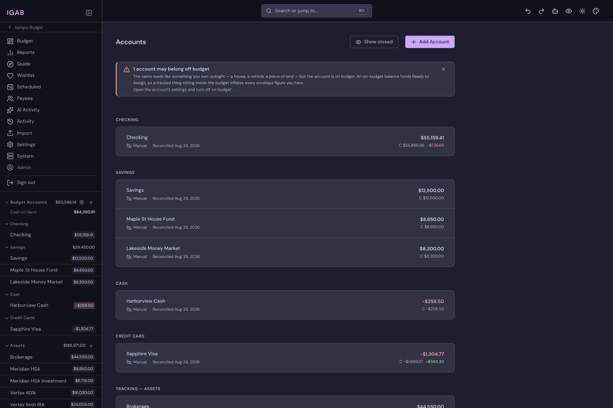
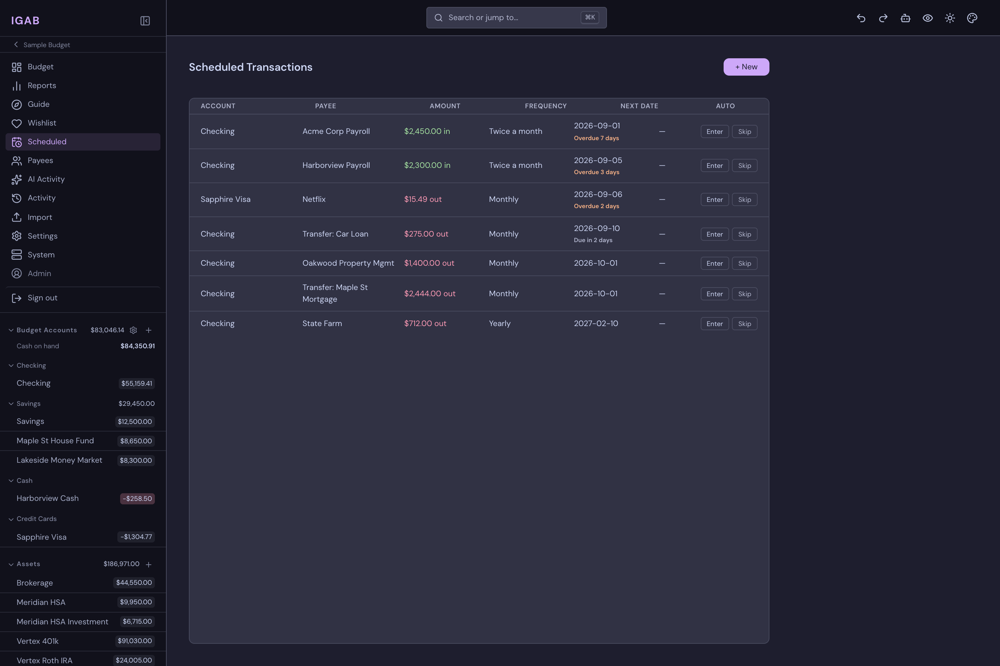
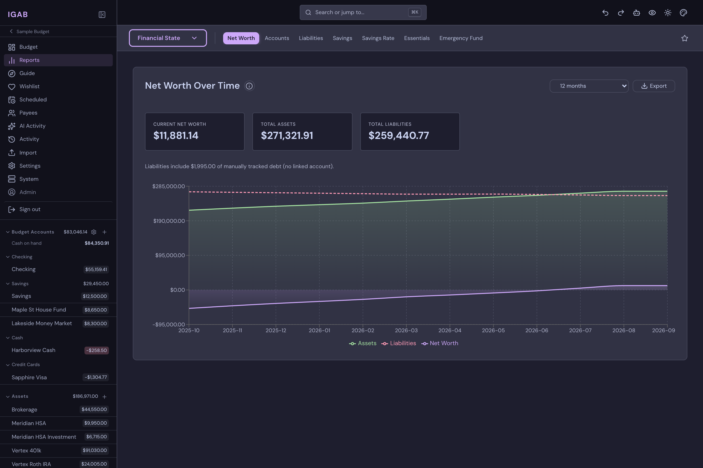
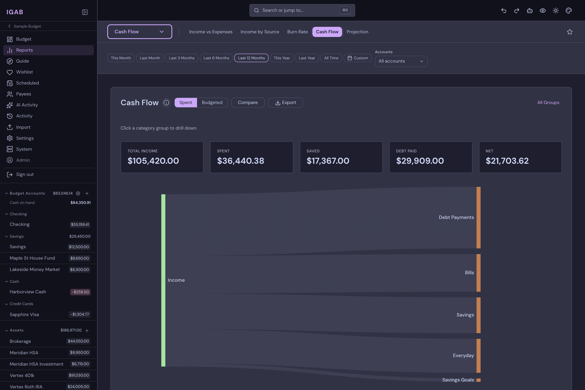
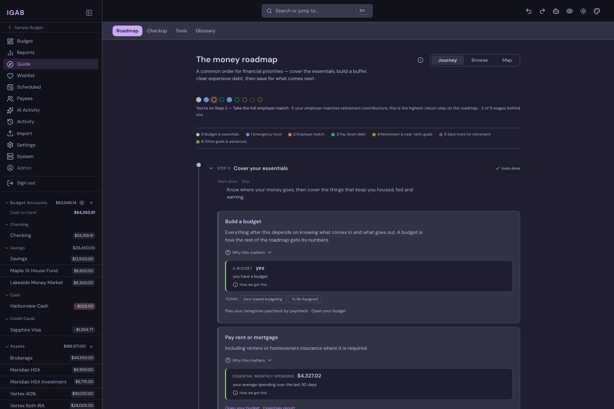

# Screenshots

A visual tour of IGAB, on the sample budget in Catppuccin Mocha — the app
ships 20 palettes in 40 dark/light variants, and any of them can be used here.

Regenerate with `just screenshots` (needs the dev stack up); `just screenshots
--theme nord` or `--all` for a different palette or the extra shots. The
script is `frontend/scripts/screenshots.mjs`.

## Budget

The monthly budget grid — category groups, targets, and available balances.

## Account register

Cleared, uncleared, and working balances, with upcoming scheduled transactions
listed above the register.

## Accounts

Every account in one place, grouped by type — on-budget cash, credit, and
tracked assets.

## Scheduled transactions

Recurring income and bills, with what is due and what is overdue.

## Loans

Payoff projection, paydown chart with an extra-payment simulator, and the
amortization schedule.

## Reports

Thirty reports across six groups.

Net worth over time — assets, liabilities, and the line between them:

Where the money went, as a flow from income to category groups:

Pareto analysis of spending by category:

The overview dashboard — to be assigned, net worth, burn rate, savings rate,
and top spending:

## Guide

A money roadmap that reads the budget's own figures and says which step you
are on.

