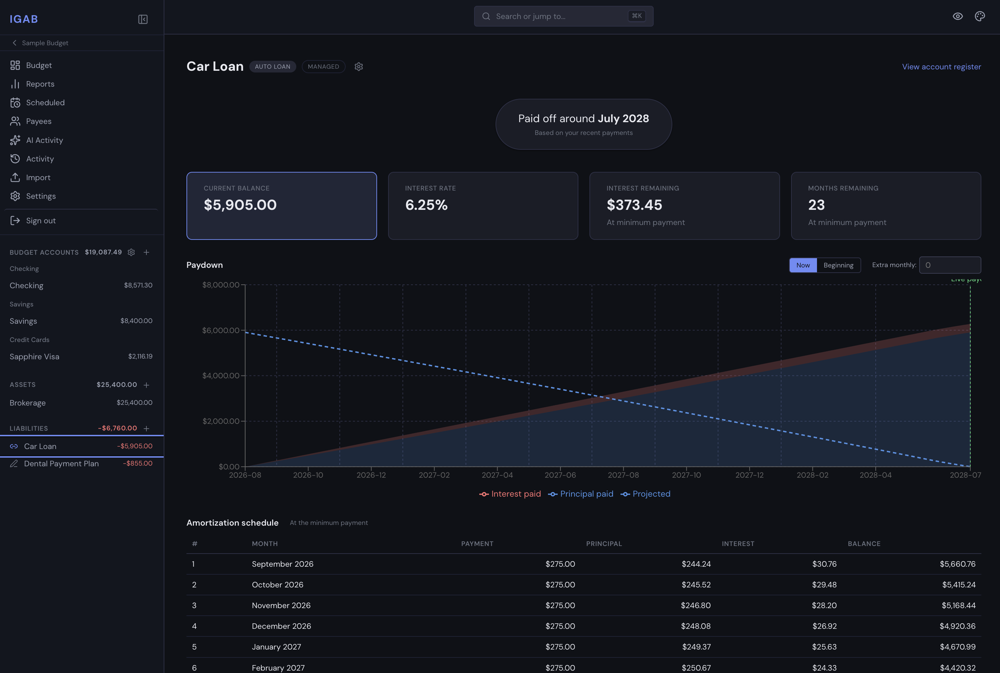
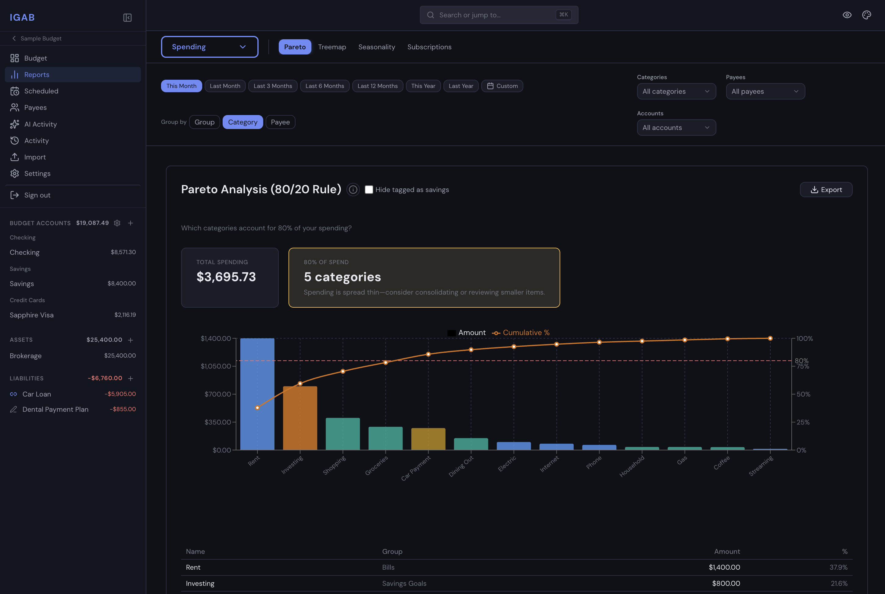
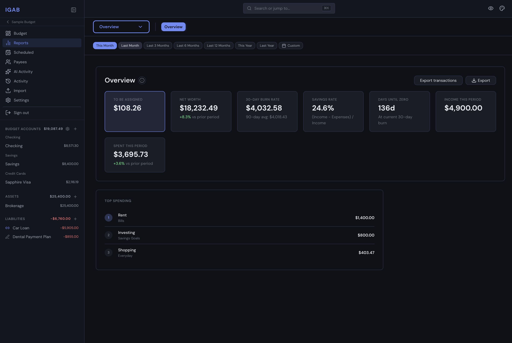

# Screenshots

A visual tour of IGAB. Screenshots are taken with the default dark theme; the
app ships nine themes in total.

## Budget

The monthly budget grid — category groups, targets, and available balances.

## Account register

Cleared, uncleared, and working balances, with upcoming scheduled transactions
listed above the register.

## Loans

Payoff projection, amortization schedule, and a paydown chart with an
extra-payment simulator.

## Reports

Twenty reports across six groups. Pareto analysis of spending by category:

The overview dashboard — to be assigned, net worth, burn rate, savings rate,
and top spending:

